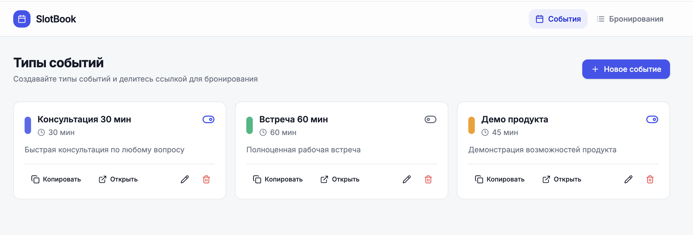
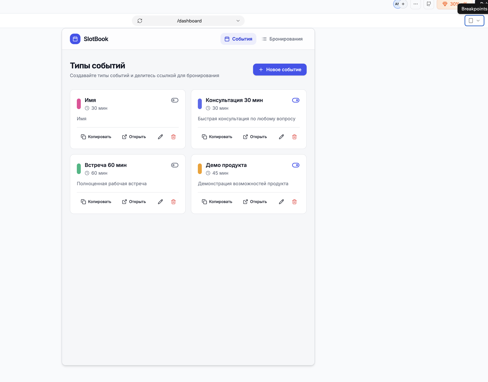
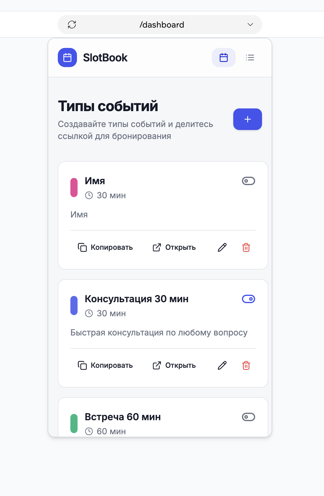
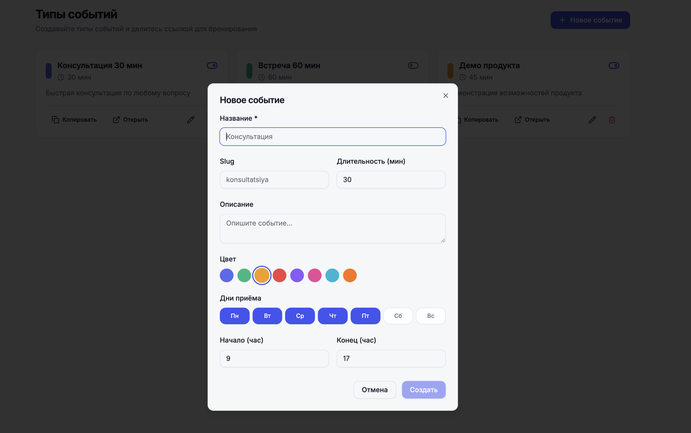
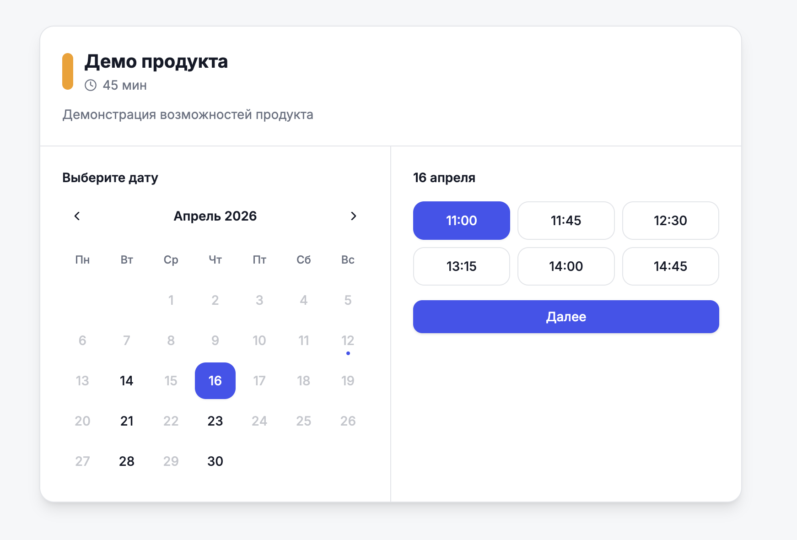
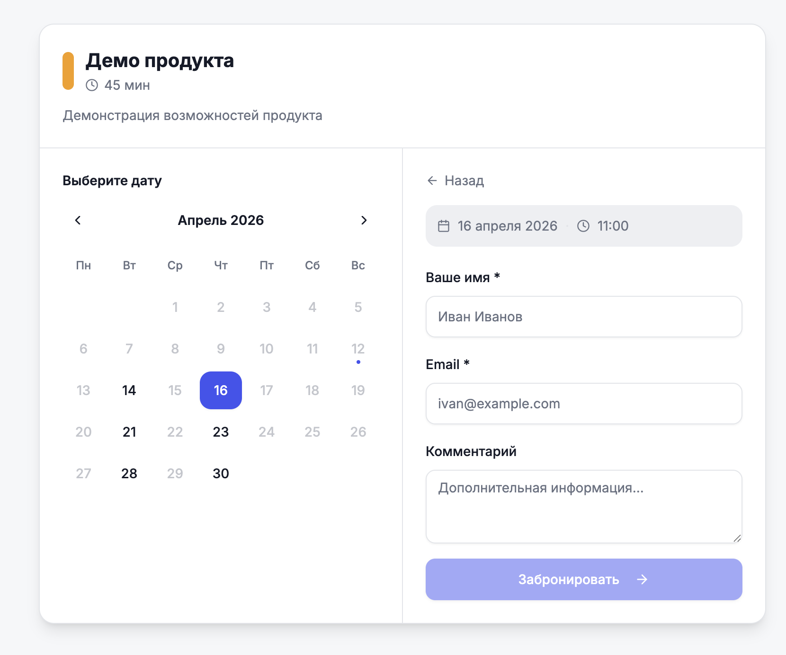
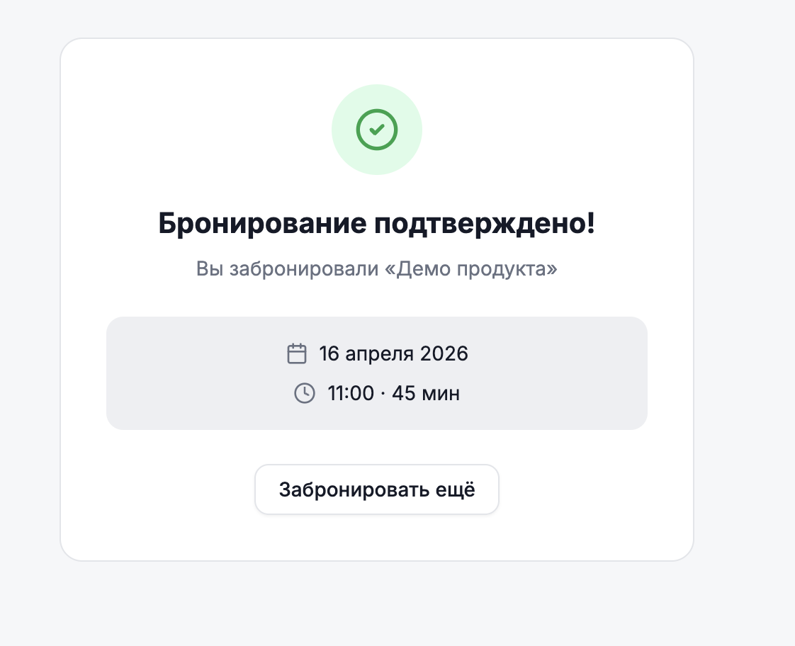
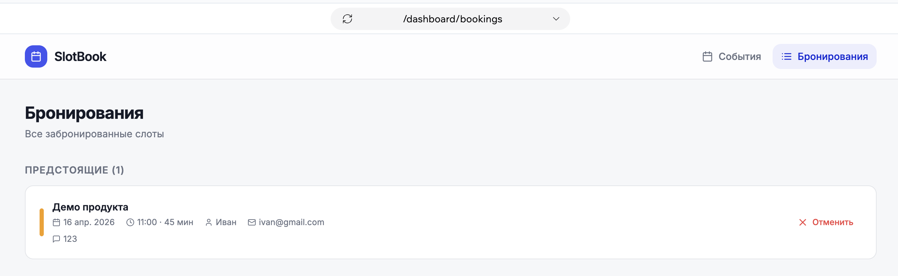
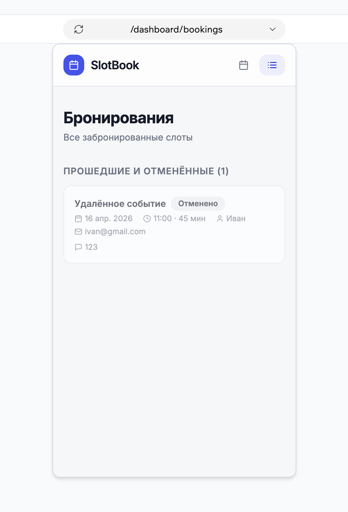

# SlotBook

Сервис онлайн-записи на встречи. Создавайте типы событий, делитесь ссылкой — гости бронируют удобный слот без регистрации.

---

## Интерфейс

### Дашборд — типы событий

Управляйте типами событий: задайте продолжительность, часы приёма, цвет и поделитесь публичной ссылкой.



Интерфейс адаптирован под планшет и мобильный:

| Планшет | Мобильный |
|---------|-----------|
|  |  |

### Создание события

Настройте новый тип события: название, slug, продолжительность, описание, цвет, рабочие дни и часы.



### Публичное бронирование

Гость открывает вашу ссылку и проходит три шага:

**Шаг 1 — Выбор даты и времени**



**Шаг 2 — Контактные данные**



**Шаг 3 — Подтверждение**



### Дашборд — бронирования

Список предстоящих и прошедших встреч. Отмена в один клик.



На мобильном прошедшие и отменённые встречи вынесены в отдельный раздел:



---

## Возможности

- **Типы событий** — несколько форматов встреч (консультация, демо, встреча) с индивидуальной продолжительностью и расписанием
- **Публичная страница бронирования** — уникальная ссылка на каждый тип события, гостям не нужна регистрация
- **Выбор слота** — календарь с датой и сеткой доступного времени
- **Управление бронированиями** — предстоящие, прошедшие и отменённые встречи в одном дашборде
- **Активация/деактивация** — включайте и отключайте типы событий без удаления
- **Адаптивный дизайн** — десктоп, планшет, мобильный

---

## Стек

| Часть | Технологии |
|-------|------------|
| Фронтенд | Vue 3, TypeScript, Vite, shadcn-vue, Tailwind CSS v3 |
| Роутинг и формы | Vue Router, VeeValidate + Zod |
| Запросы | TanStack Query |
| Календарь | @schedule-x/vue (дашборд), кастомная сетка слотов (публичная страница) |
| Интернационализация | vue-i18n (ru + en) |
| Бэкенд | FastAPI, PostgreSQL |
| Инфраструктура | Docker Compose, Nginx, GitHub Actions |

---

## Запуск

### Предварительные требования

- Docker и Docker Compose

### Старт

```bash
# Запустить все сервисы
docker-compose up

# Применить миграции базы данных
docker-compose exec api alembic upgrade head
```

После запуска:
- Фронтенд: http://localhost:5173
- API: http://localhost:8000

---

## Тесты

```bash
# E2E тесты (Playwright)
cd apps/web && npx playwright test
```
